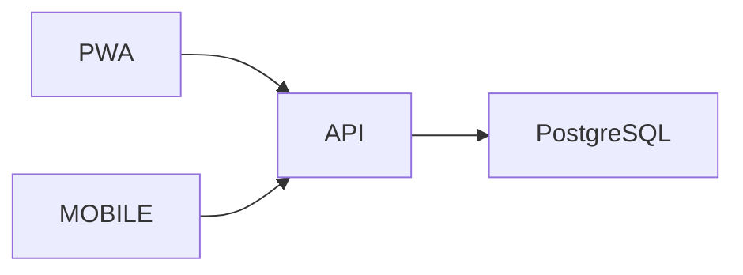

# NoteSync

## Opis projektu

NoteSync to aplikacja do tworzenia notatek pomiędzy aplikacją webową oraz aplikacją mobilną Android.

## Główne funkcjonalności

* Rejestracja użytkownika
* Logowanie JWT
* Tworzenie notatek
* Edycja notatek
* Usuwanie notatek
* Tagi notatek
* Synchronizacja danych
* Powiadomienia mobilne

## Technologie

### Backend

* FastAPI
* SQLAlchemy
* PostgreSQL
* JWT Authentication

### PWA

* React
* Vite
* Service Worker
* IndexedDB

### Mobile

* React Native
* Expo
* AsyncStorage
* Expo Notifications

### Infra

* Docker
* Docker Compose
* GitHub Actions

## Architektura



## Bezpieczeństwo

* JWT Authentication
* Hashowanie haseł bcrypt
* Walidacja danych wejściowych
* CORS
* Ochrona endpointów wymagających autoryzacji

### PWA

Service Worker przechowuje zasoby aplikacji w pamięci podręcznej przeglądarki.

### Mobile

Dane przechowywane są lokalnie przy użyciu AsyncStorage.

Po odzyskaniu połączenia następuje synchronizacja z backendem.

## Uruchomienie projektu

### Backend

```bash
cd backend
pip install -r requirements.txt
uvicorn app.main:app --reload
```

### PWA

```bash
cd pwa
npm install
npm run dev
```

### Mobile

```bash
cd mobile
npm install
npx expo start
```

## Testy

Backend:

```bash
pytest
```

PWA:

```bash
npm test
```

Mobile:

```bash
npm test
```